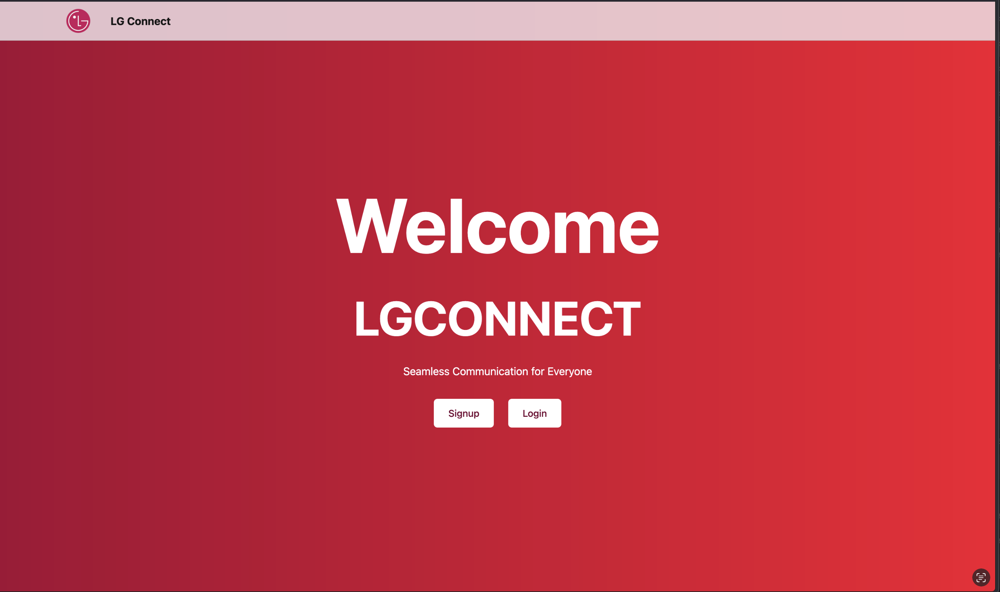
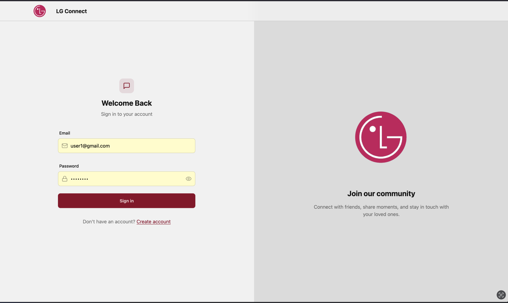

# LG Connect - Real-time Chat Application with AI Assistant

LG Connect is a modern real-time chat application built with React, Node.js, and Socket.IO, featuring an integrated AI assistant powered by OpenAI.

## Screenshots

### Main Chat Interface


### AI Assistant in Action


## Features

- 💬 Real-time messaging with Socket.IO
- 🤖 AI-powered message assistant
- 🔒 Secure authentication
- 📱 Responsive design
- 🎨 Modern UI with Tailwind CSS
- 🔄 Real-time message updates
- 📸 Profile picture support
- 🌐 Cross-platform compatibility

## Tech Stack

### Frontend
- React.js
- Tailwind CSS
- Socket.IO Client
- Zustand (State Management)
- Axios

### Backend
- Node.js
- Express.js
- Socket.IO
- MongoDB
- OpenAI API
- JWT Authentication

## Quick Start

1. Clone the repository
2. Install dependencies (see [Documentation](docs/README.md))
3. Set up environment variables
4. Run the application

For detailed installation and setup instructions, please refer to our [Documentation](docs/README.md).

## Project Structure

```
lg-connect/
├── backend/          # Node.js backend
├── frontend/         # React frontend
├── docs/            # Documentation
└── README.md
```

## License

This project is licensed under the MIT License - see the [LICENSE](LICENSE) file for details.

## Support

For support, email support@lgconnect.com or open an issue in the repository.